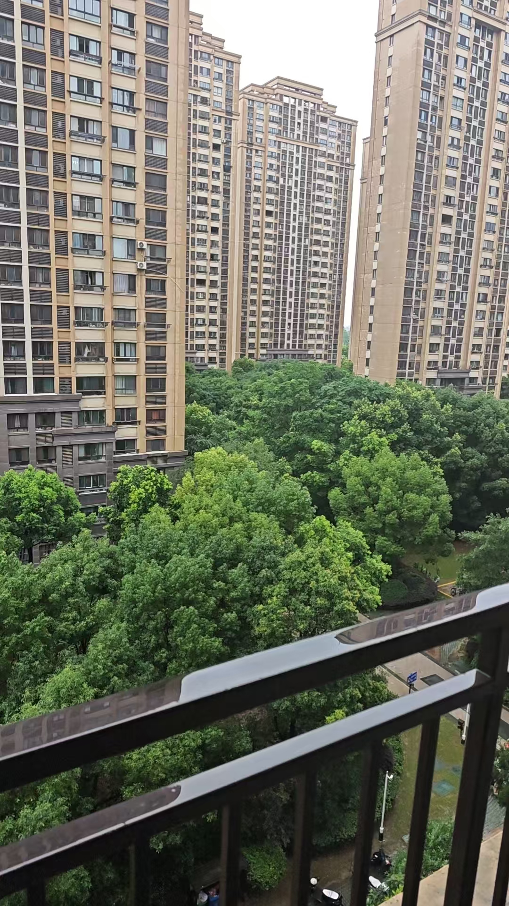
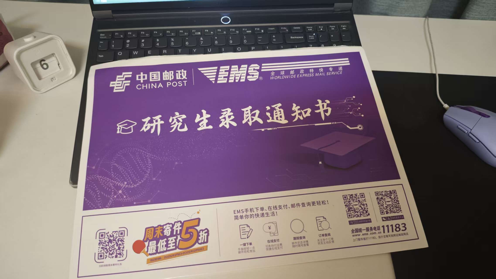
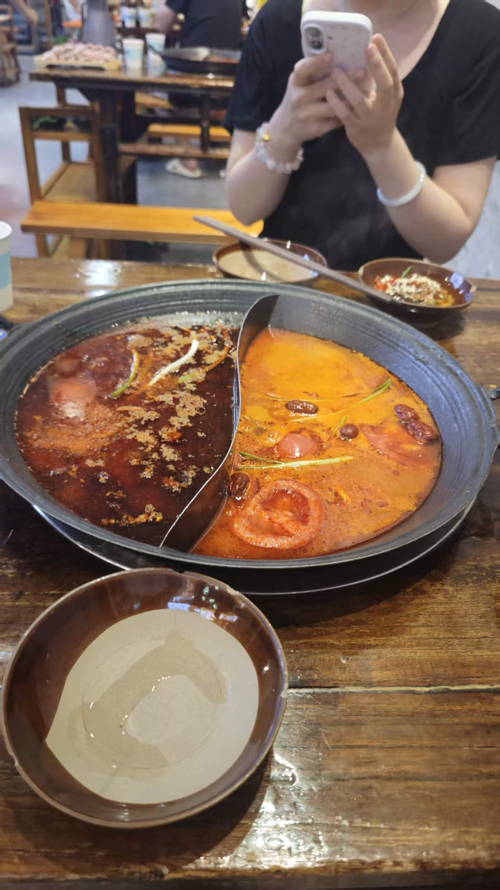

## 📋 本周概览

暑假家教的第一周，共完成 **9 节课**，生活节奏逐步建立，整体充实而有收获。

## 📚 家教进展

### 🧮 高一数学（5 节）
- 第一节课 — 初高中衔接 + 1.1 集合的概念与表示
- 第二节课 — 1.2 子集、全集、补集
- 第三节课 — 1.3 交集、并集
- 第四节课 — 第一章综合复习 + 2.1 命题、定理与定义
- 第五节课 — 2.2 充分条件、必要条件、充要条件

学生基础较好，知识点能及时掌握。主要问题在于：审题不够细心、基础题偶有粗心错误、充分与必要条件辨析偶尔混淆，需要持续加强 ✍️

### 🔬 初二物理 & 英语（4 节）
- 第一节课 — 7.02 上午首次开课 🎬
- 第二节课 — 7.03
- 第三节课 — 7.04
- 第四节课 — 7.05

备课方面总结出高效方法：物理过一遍课本 +《教材帮》知识点，《必刷题》挑难题看思路即可；英语过语法讲义 + 单词 + 词组即可，无需每题都做 💡

## 🎯 重大事件
- 🎓 收到**研究生录取通知书** 🎉

- 🥢 收到天大毕业礼物「筷子」

## 🏠 生活方式
- 🍜 和宝宝一起吃饭——药膳鸡、阿甘火锅、肯德基

- 🛍️ 逛街 UR 连衣裙，逛书店多抓鱼
- 🎮 晚上常在网吧打瓦（无畏契约），比自己的电脑体验好太多了
- 😴 睡眠问题突出：备课到深夜，经常凌晨两点后才睡，需要尽快调整

## ⚡ 待改进
- [ ] 调整备课节奏，争取晚上 12 点前睡觉
- [ ] 恢复健身习惯（本周仅计划了一次，未执行 🥲）
- [ ] ⌨️ 购入新键盘
