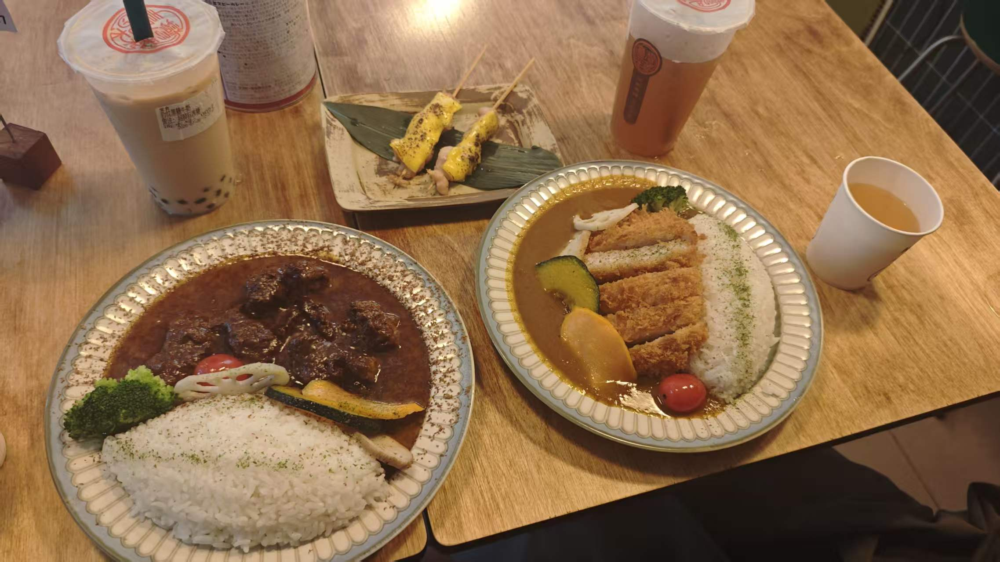
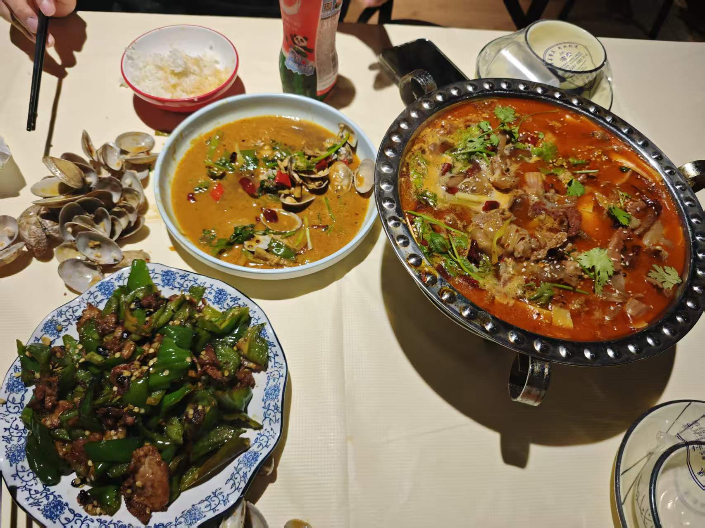
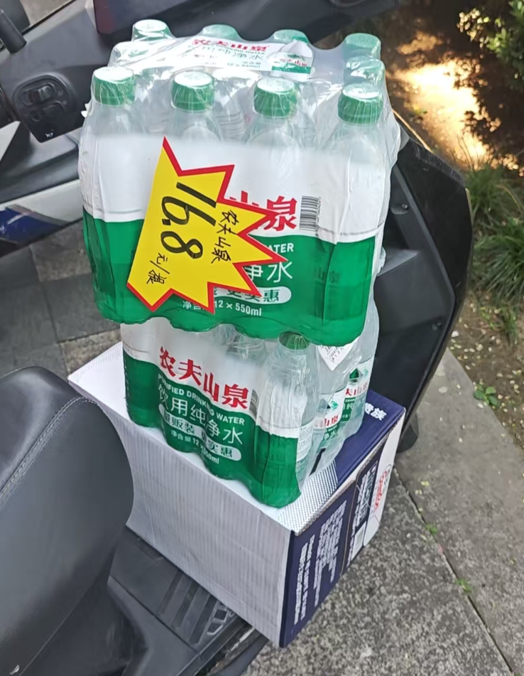

## 📋 本周概览

暑假家教的第二周，共完成 **11 节课**，去了一趟南京帮宝宝搬行李，Obsidian 工作流持续优化，生活节奏逐步调整中。

## 📚 家教进展

### 🧮 高一数学（5 节）
- 第六节课 — 7.06
- 第七节课 — 7.07
- 第八节课 — 7.09
- 第九节课 — 7.10
- 第十节课 — 7.11
- 第十一节课 — 7.12 天气原因取消 🌧️

### 🔬 初二物理 & 英语（6 节）
- 第五节课 — 7.06
- 第六节课 — 7.07
- 第七节课 — 7.09
- 第八节课 — 7.10
- 第九节课 — 7.11
- 第十节课 — 7.12

重要调整：初二家教后续改为**物理 + 数学**，上课时间保持 **8:40-10:40**。

## 🎯 重大事件
- 🚗 7.07 晚上和宝宝坐车去南京，帮宝宝收拾出租屋行李带回扬州

- 🦞 7.11 晚上和ht聚餐，吃宋记龙虾

- 🛒 7.10 711 满 100-50 活动，囤了两箱水（百岁山 + 农夫山泉）只花了 58 元 💰

## 🛠️ Obsidian 优化
- 安装 **Paste Image Rename** 插件，图片自动命名为「笔记名-序号」并归档到附件文件夹
- 修改 CSS 使图片在阅读模式下居中显示
- 优化 homepage 主页，显示总文章篇数、总字数、当天任务和第二天任务

## 🏠 生活方式
- 🎮 晚上常在网吧打无畏契约，开始学捷风的玩法
- 🌾 和宝宝一起玩星露谷
- 🍛 南京吃了咖喱饭和藕饼，味道不错
- 🍵 给宝宝买了喜茶的茉莉绿妍蝴蝶酥和金凤茶酥
- 🍜 粉面菜蛋太好吃了 😋

## ⚡ 待改进
- [ ] 调整作息，早睡（仍经常熬夜，第二天状态差 😴）
- [ ] 恢复健身习惯（下课去健身房的计划还没落地 💪）
- [ ] ⌨️ 购入新键盘和新耳机
- [ ] 🫃 注意饮食，防止胃胀气
