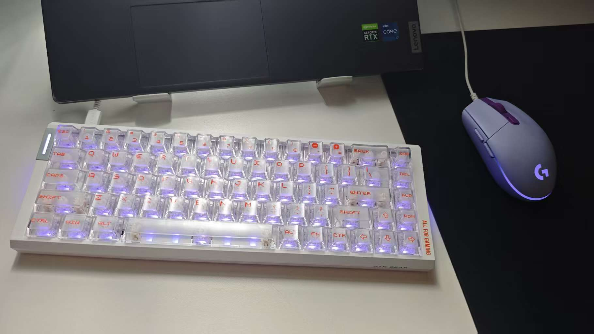
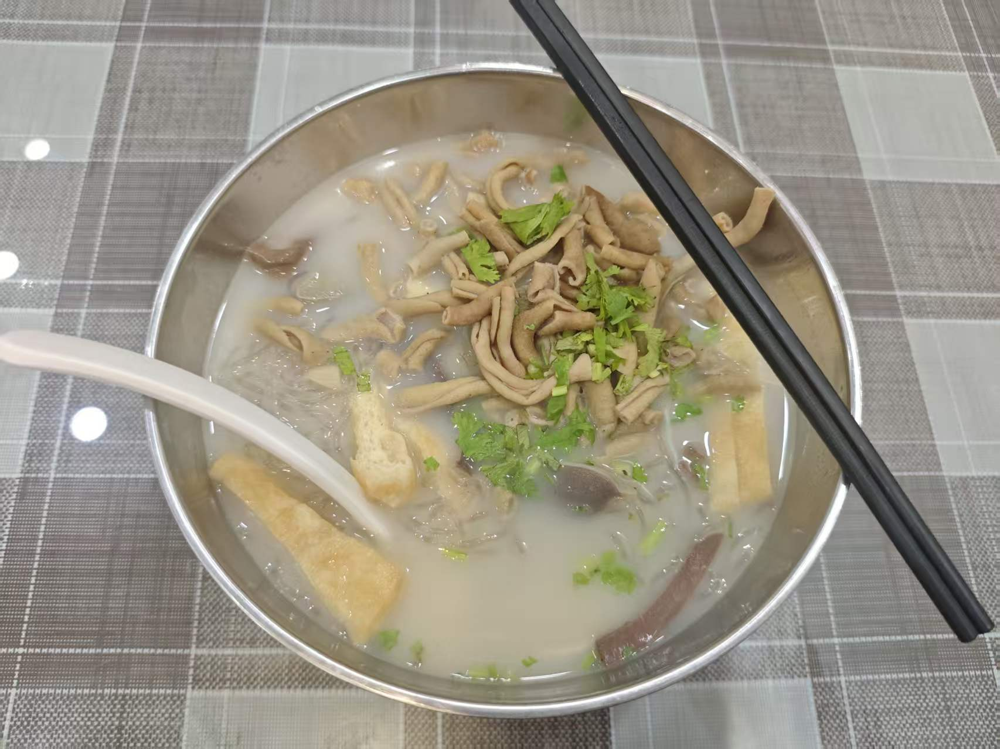
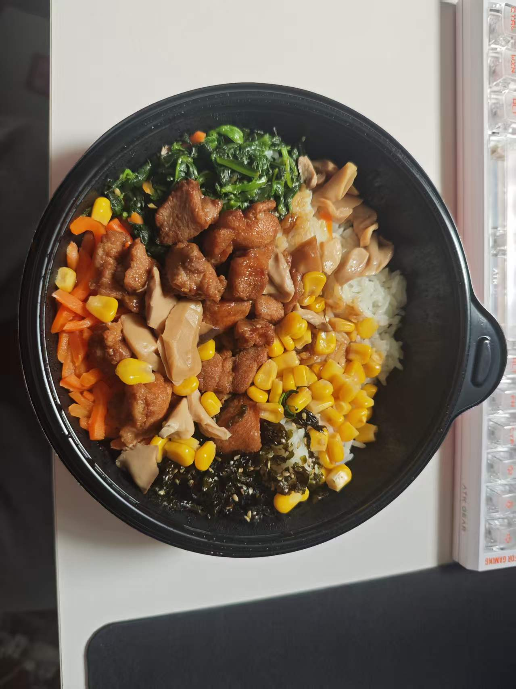
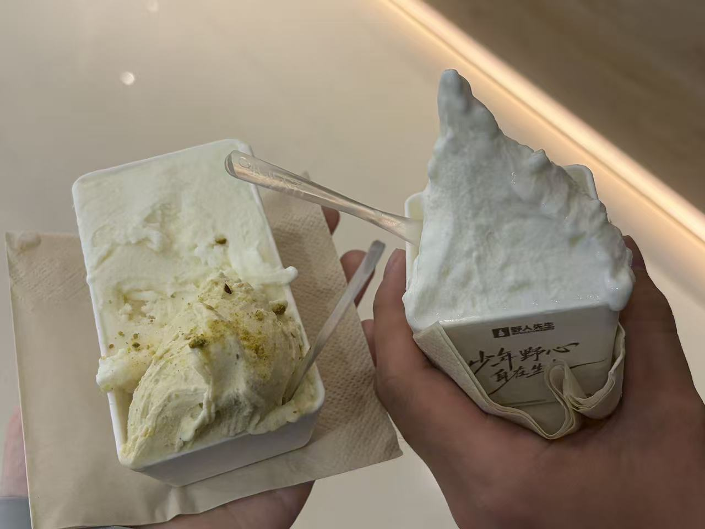
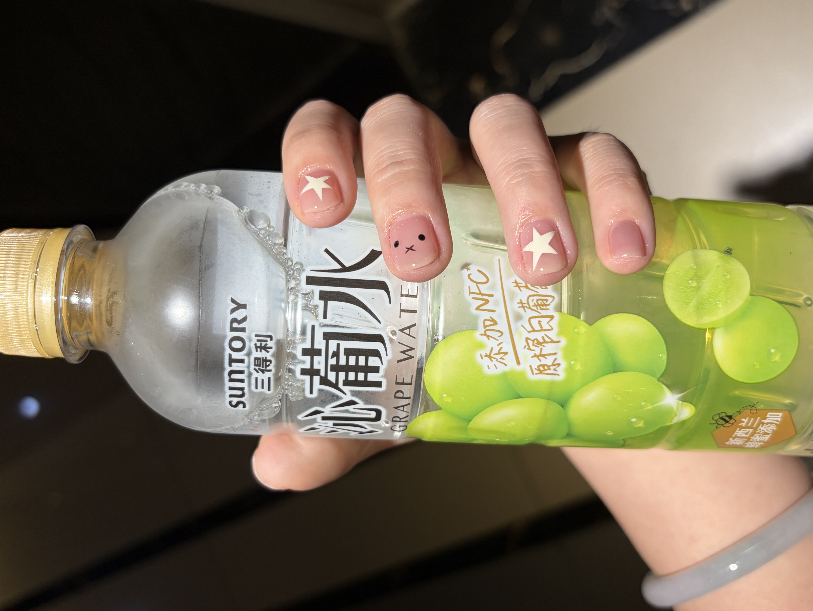
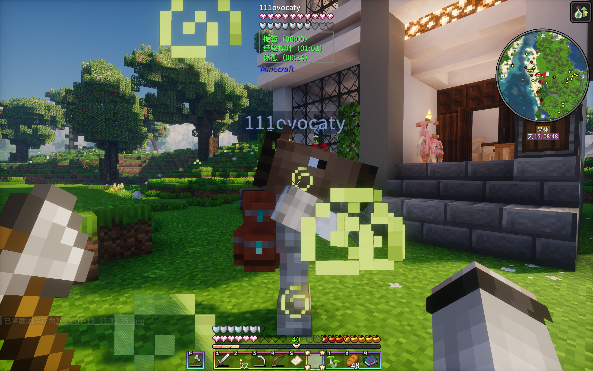
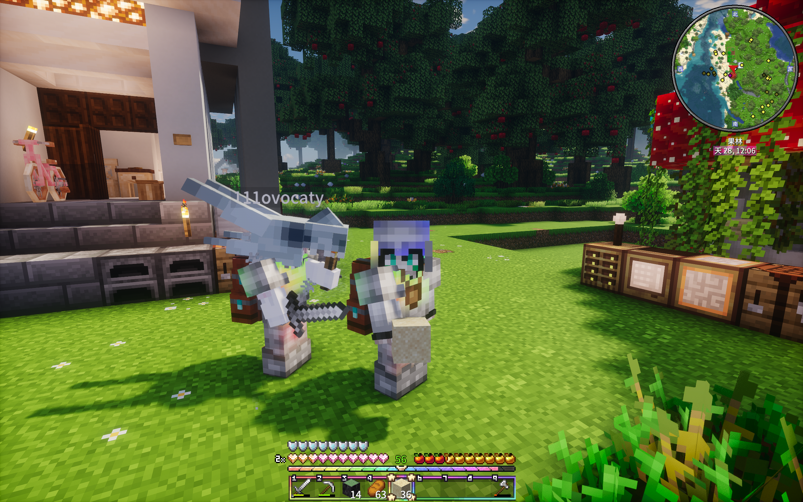
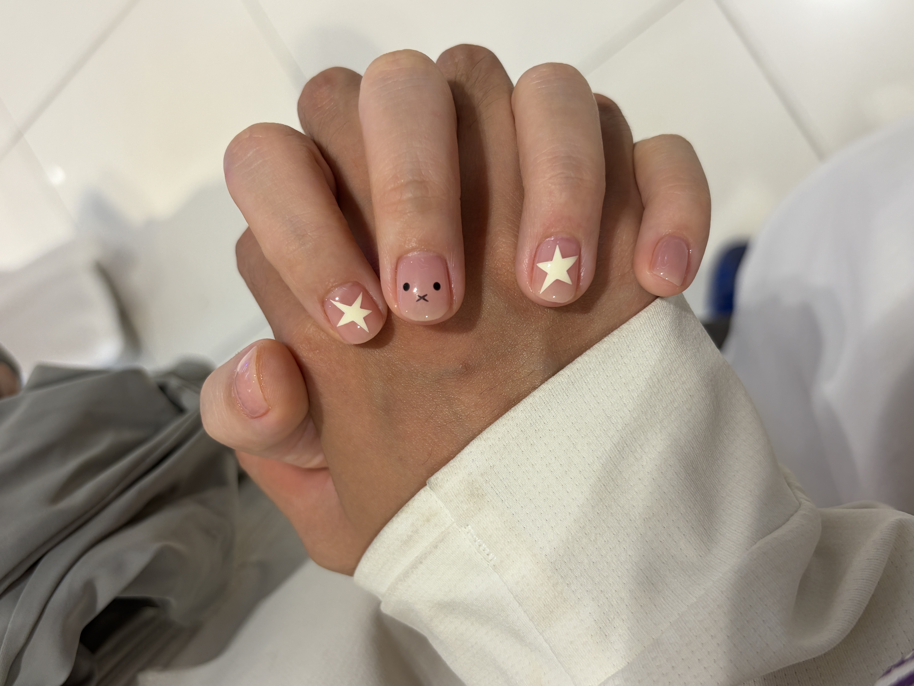
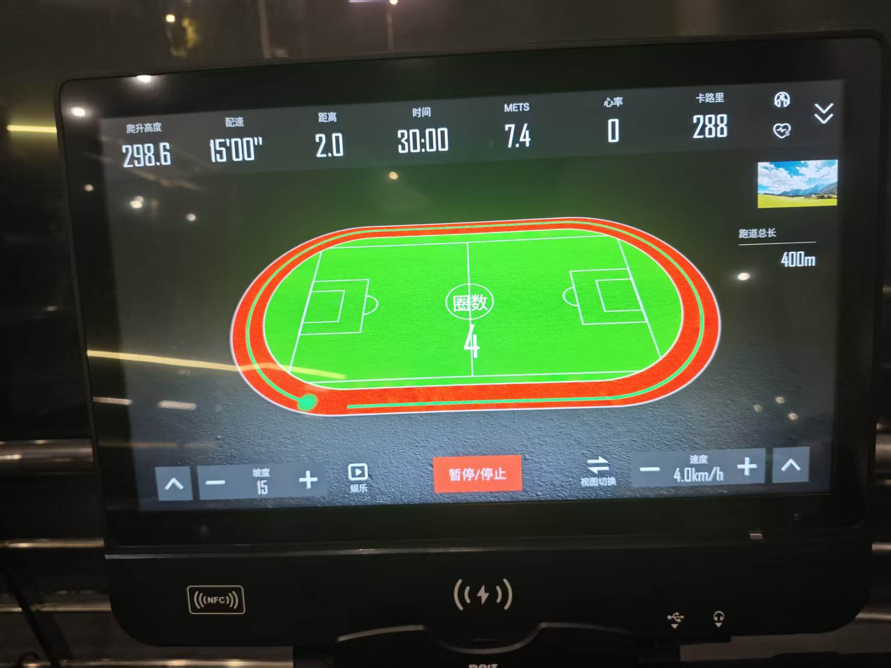

## 📋 本周概览

本周共完成 **12 节课**，健身计划重启，去南京帮宝宝搬完了最后一批行李，还订好了月底福建旅行——忙碌但充实的一周。

## 📚 家教进展

### 🧮 高一数学（5 节）
稳步推进中。7.19 下午因大雨取消一节 🌧️

### 🔬 初二物理 + 数学（7 节）
本周开始**新增数学预习**，买了必刷题教辅。第一节数学课讲太快、没带做例题，正确率偏低——第二天调整，放慢节奏、先讲例题再做题，效果好转。教学相长，自己的备课方法也在迭代 ✍️

### 🧪 新学生：九上化学（1 节）
7.18 上课，预习九上化学第一单元

## 🎯 重大事件
- ⌨️ **新键盘到啦！** 闷闷的声音不吵，很喜欢，下一步攒钱买耳机和鼠标

- ✈️ 定了福建旅行：7.30 扬州→厦门，福州→扬州，来回机票酒店人均约 2000

- 🧳 第二次去南京帮宝宝搬行李，一车装满满的，全都搬完了

- 🏋️ **健身重启**：去凯奇健身办了月卡（186/月，有一点贵，场地大器材新），练了胸+三头、背+二头各一次

## 🏠 生活方式
- 🍜 饮食：望月路老鸭粉丝汤（高中回忆）、米村拌饭、酸菜鱼面、野人先生冰淇淋

- 🍲 和宝宝在家煮火锅、吃紫燕百味鸡、丰盛家常菜（孜然猪蹄、红烧肉、剁椒鱼头）
- 💅 陪宝宝做美甲，本甲风格，简洁好看

- 🎮 和宝宝玩星露谷、我的世界（香草纪元整合包），一起种田建房子 🏡

- 🌧️ 下了好几场大雨，骑车头盔进水，下午课因此取消过
- ☀️ 手晒黑了，每天早上去家教在路上晒的

## ⚡ 待改进
- [ ] ☀️ 有氧训练计划：坚持住，练肩日记得加有氧

- [ ] 继续调整作息，后两天终于有假可以睡懒觉
- [ ] 初二数学教学继续优化，保持「先讲再练」的节奏
