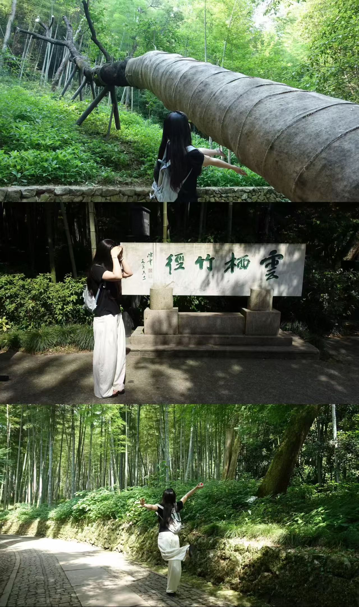
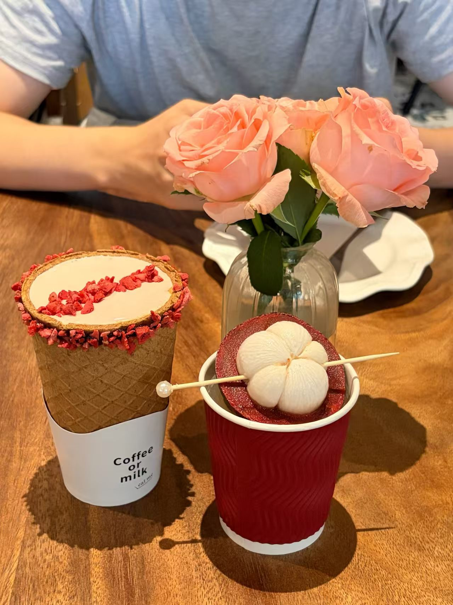
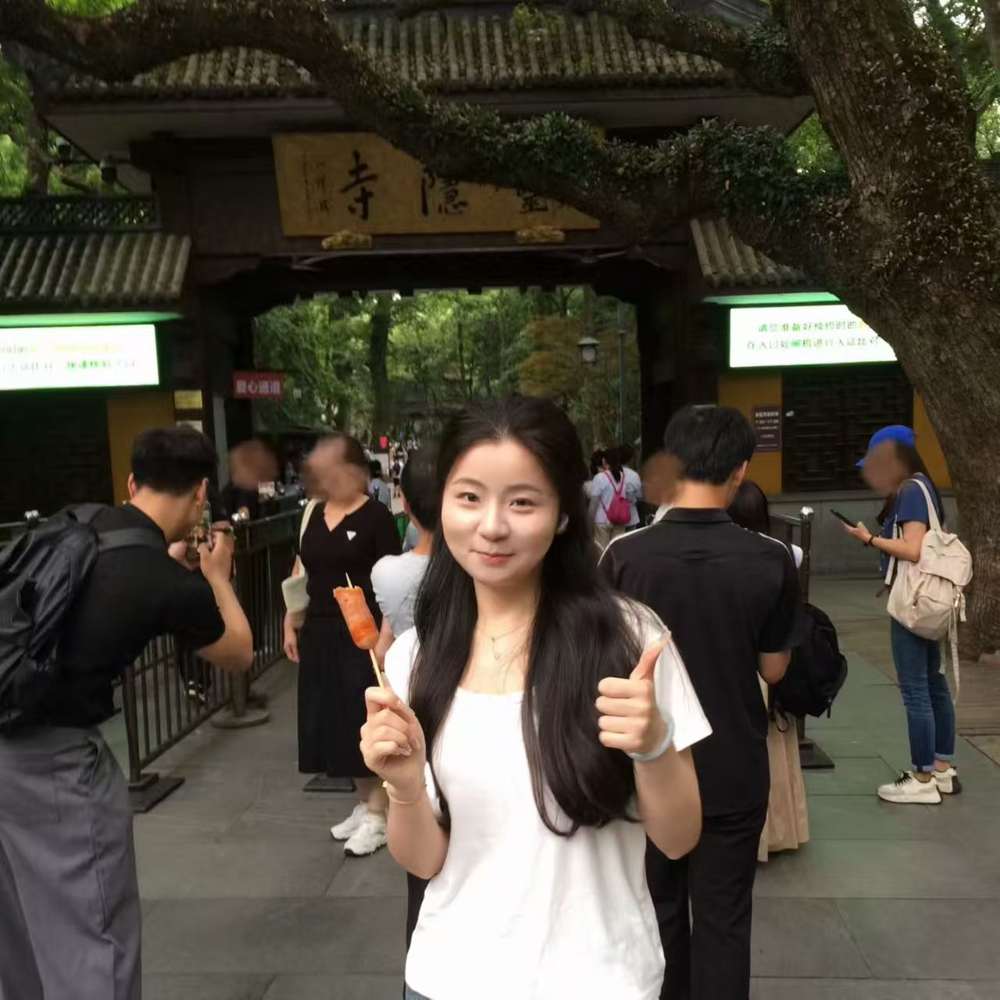
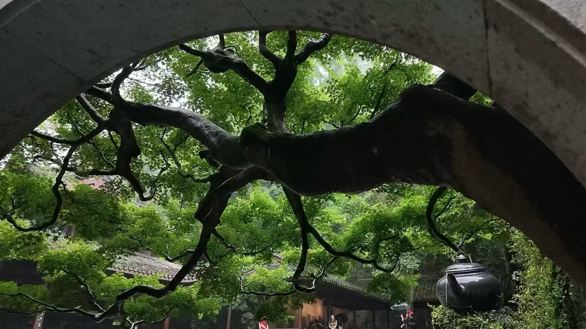

# ✨ 我想先讲出行之前我内心有过的想法。
预计的三天时间卡得很紧，提前和推迟大概都是不可行的，我已经是自由的状态了，不过玻璃球还要面临答辩和归档，我内心总在隐隐担忧，会不会出什么意外，万一他的学校里有事怎么办？那我是要很失望的，不过我嘴上一定要表现得很理解的样子，毕竟快毕业了，还是学校的事情最重要！我就这样忐忑地度过了美好降临前的三四天，直到玻璃球真的坐上了来南京的车，我才踏实的坦然的去尽情期待即将到来的杭州之旅。
## 🌿 day1
第一天大早，坐上了从南京到杭州的动车，我在完善我的妆容，玻璃球很安静的坐在我的右边，每次和他坐车，我都是坐在靠窗户的位置。到了杭州，先去办理入住，奢侈一把订的酒店真的很好，我喜欢宽敞的能够呼吸的感觉，讨厌逼仄的空间。紧接着就去吃了午饭，可以说是这三天我最满意的一顿，**臭豆腐煲那么香，肥肠那么脆**，写到这里我又很想念这个味道了，而且我们没有等位，恰巧有空位，和玻璃球在一起总觉得很幸运。吃饱喝足，我们坐公交去云栖竹径，我穿的鞋不太好走路，不过景色很美，玻璃球给我拍的照片我也喜欢，和他在一起的时候，没有那么恐惧镜头。

我喜欢和他一起看树，很高大郁郁葱葱，想到它们一两百年前就在这里，如今和我在一个空间，就心里有点涟漪。晚上回到酒店点外卖，还点了一个蛋糕，迟到的庆祝我们的400天，当点燃蜡烛，我把头靠向他的时候，希望这样的幸福能一直流淌在我的生命里，永远都不要忘记。

## 🚣 day2
第二天，我们早起去西湖划船，玻璃球帮我卷头发，他真的是太有耐心的一个人了，面对不好用的卷发棒，还有耐心随时告罄的我，还能一缕一缕卷好，事实证明在拍照的时候**卷发so nice**，虽然划船强制要求穿橙色的救生衣，划船小哥还是让我脱下了一会，方便我拍照，拍到了我最最喜欢的照片^_^

回酒店的路上喝到了此行 **best 饮品山竹冰**。

灵隐寺倒是没什么太深的印象了，只记得没吃到素面，有点可惜…

## 🌧️ day3
第三天下雨了，给虎跑公园蒙上了湿漉漉的滤镜，很美，可是我这个人下雨天真的很难up，虎跑也不大，很快就走完了。

当机立断打车去看脂女团，这里要大大表扬玻璃球同志，愿意陪我在那里排队，领到了倒数第十个和她们合照的机会，虽然时间紧，不够多说几句话，但还是很幸福的结尾。

为此我们还改签了最晚一班回南京的车，**玻璃球真的很好**，特别感谢他在此旅程中对小礼物的悉心照顾，好开心呀，复盘了一遍好像是重新游玩了一次一样。
经过这次的杭州之旅，**我更坚定和玻璃球是如此的合拍，希望他也同我一样，期待着下一趟旅程。**

> *我也期待着下一次的旅行*
