# 🌸 记录与女朋友在杭州的三天之旅

六月十一日，早上八点五十五分，我们坐上了 G7627 次列车，从南京南驶向杭州东。那天天气很好，车厢里安安静静的，乘客也不多。十点二十四分，列车停靠在杭州东站，属于我们的杭州之旅就这样开始了。

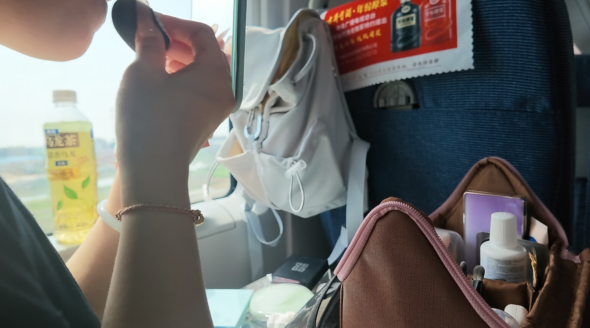

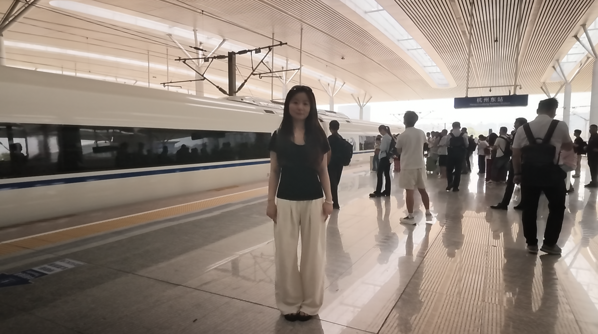

***
## 🌿 第一天 · 云栖竹径

到酒店放完行李后我们直奔饭店，**好饿好饿，好吃好吃 😋**

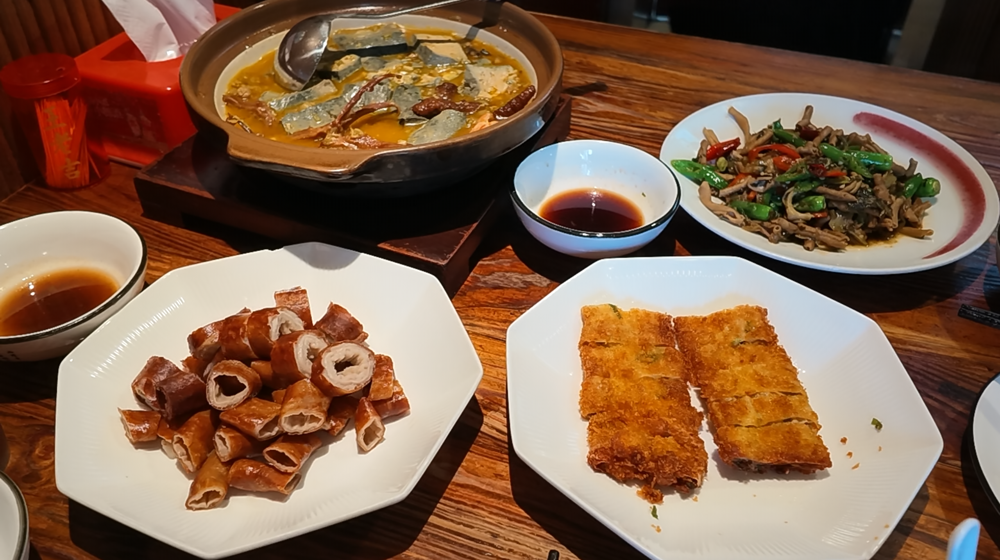

吃饱喝足后我们出发去了云栖竹径，太阳有点晒晒的 ☀️

那天我不应该穿短袖短裤出门的，被蚊虫咬了好多个包 T_T 🦟

方大同也来过这里，他的很多歌我喜欢听。

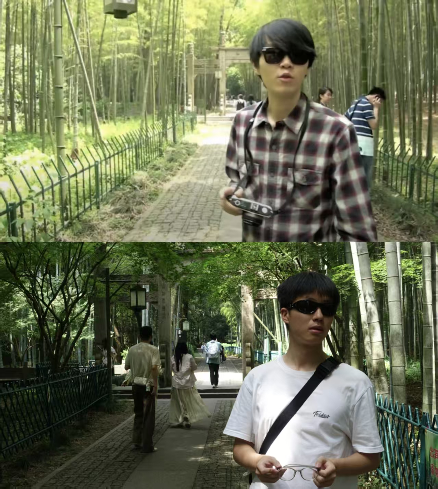

逛完云栖竹径我们早一点回到酒店休息，晚饭点了火烧云，还有一个蛋糕，**庆祝我们的 400 天纪念日 💕**

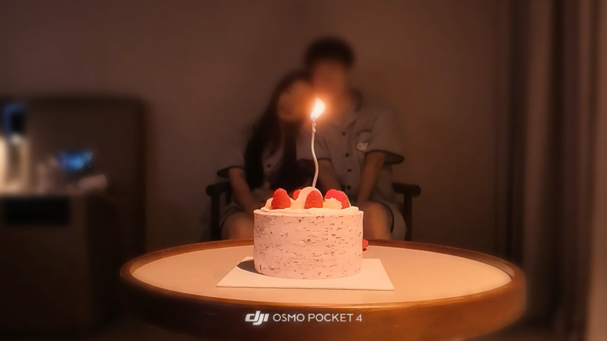

## 🚣 第二天 · 西湖 & 灵隐寺

时间来到第二天，我们今天的安排是在西湖划船。起床后我给宝宝卷头发，**学会卷发棒对我来说也是轻轻松松 💇‍♀️**

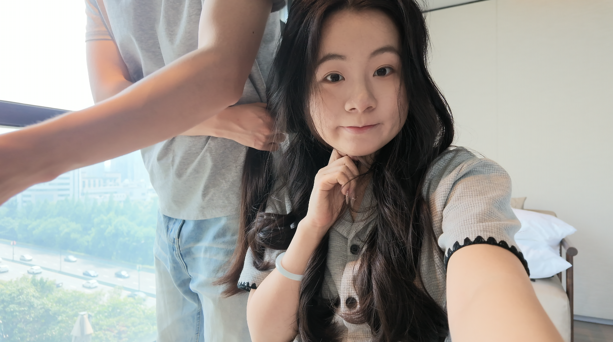

西湖湖面上很凉快，坐船时伸手就可以碰到水面，水是碧绿色的。

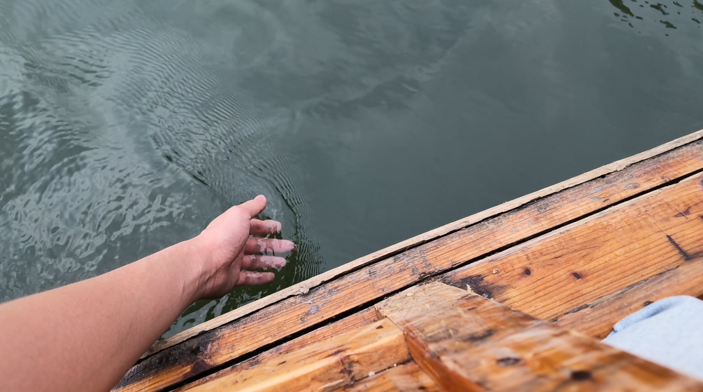
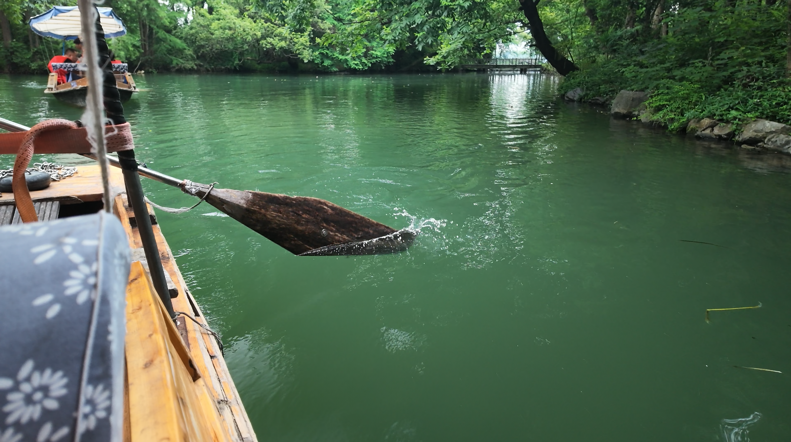

太阳很亮，卡片机拍出来的照片都不尽如人意，闪光灯曝光很难调节，要么人物很黑，要么整体都特别亮，这方面我还得加强一下。不过**大疆 pocket 拍出来很好看**，不需要自己调整好参数，使用自动的就可以拍出很美的照片。

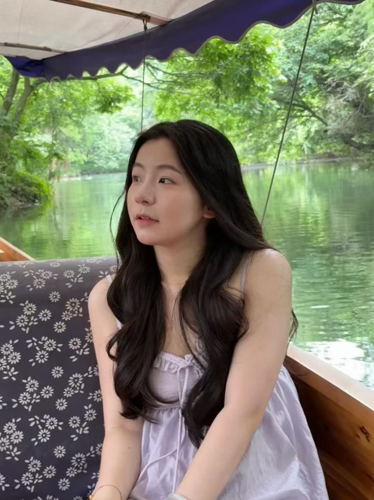
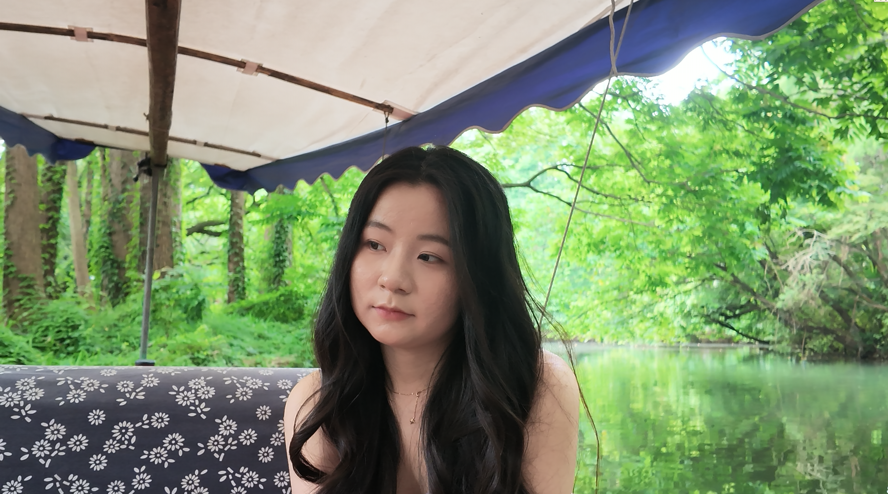
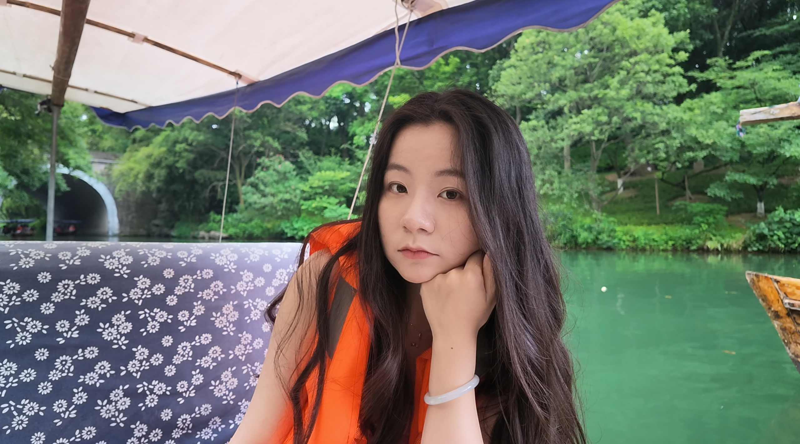

下午我们去了灵隐寺，里面有一尊像很高很大，要仰起头才能完全看到。 有个遗憾是没有吃到素面，下午五点关门，四点四十却说不做了，有点可惜。

晚饭吃的是一家泰餐，在湖滨银泰，生意挺好的，排了一会队才进去，里面还有挺多外国人的。

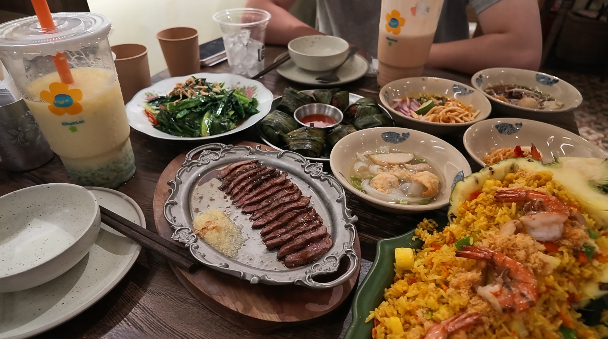

## 🌧️ 第三天 · 虎跑公园

6.13 的杭州开始下雨了，雨中的杭州又是另一番风景。今天的安排是去虎跑公园，然后是脂女团的一日店长活动。

中午我们吃了一些杭州本地特色菜，然后打车去虎跑，雨天的杭州有点堵车，不喜欢堵车 🚗💨

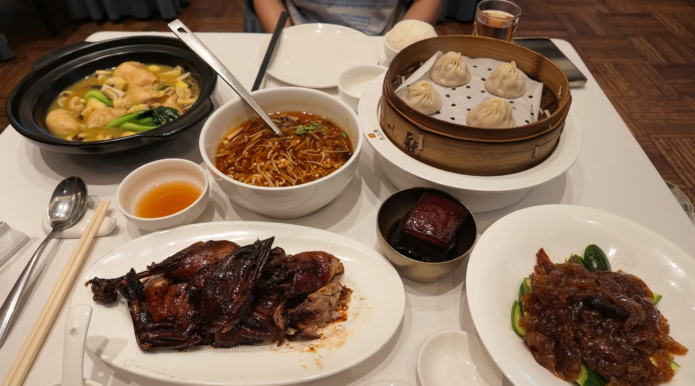

但我喜欢雨天的虎跑公园，虽然没有在晴天的时候来过，但雨天的就足够美丽。雨水淅淅沥沥，周围的环境变得很安静 🌧️🍃

虎跑公园不大，一会就逛完一圈了，之后我们打车去脂女团的一日店长活动，好火爆，队伍排了很长 🔥 不过**很幸运拿到了倒数第 10 个号**，最后合影，赶上了回南京的最后一班高铁，**是幸运的一天 🍀**

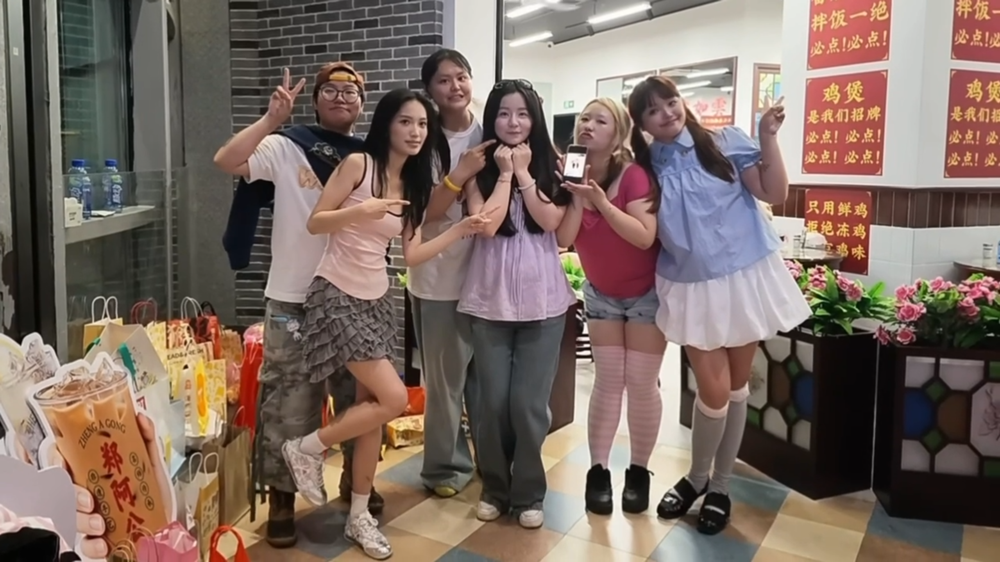

## 💌 写在最后

感觉三天没有好好逛完杭州，只是选取了一些景点，不过和小礼物在杭州玩的很开心，吃的也很开心 🥰

这一年里我们经历了很多，杭州之旅对我来说似乎是一个转折点，象征着我们异地恋的结束。尽管从杭州回来之后我还要回学校参加毕业典礼，但我知道，我在天津的时间只剩最后几天了，下一次离开天津，就真的是离开天津了，我们的见面频率也会从按月计算变为按日计算，我们会一起在南京学习生活——

**异地恋真的结束了 💗**
